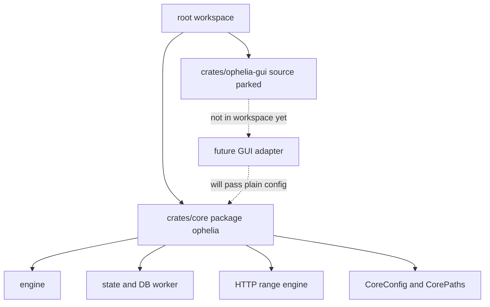
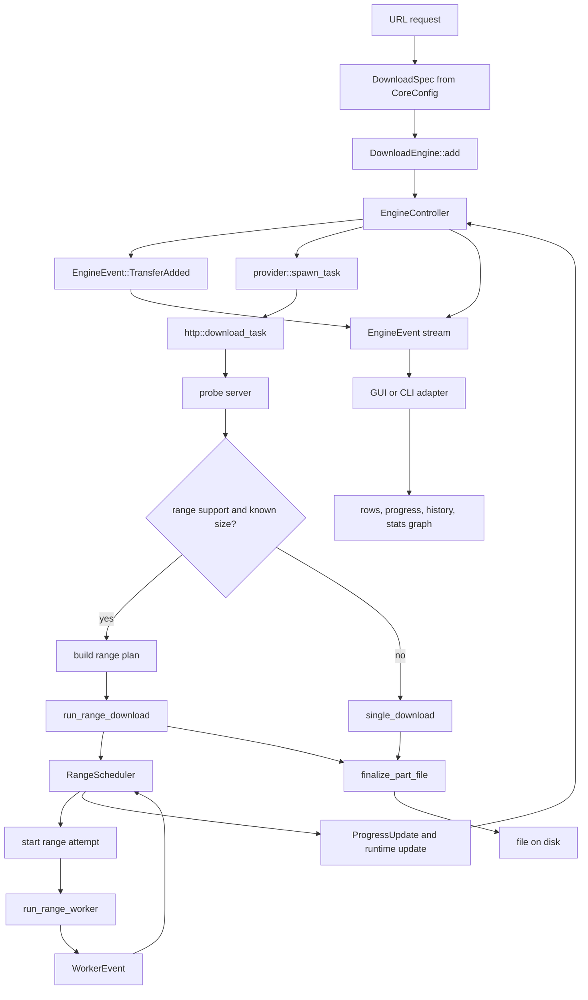
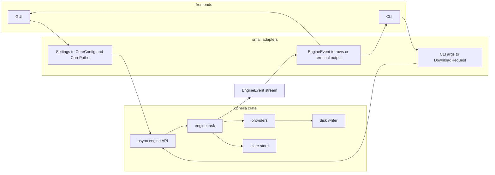
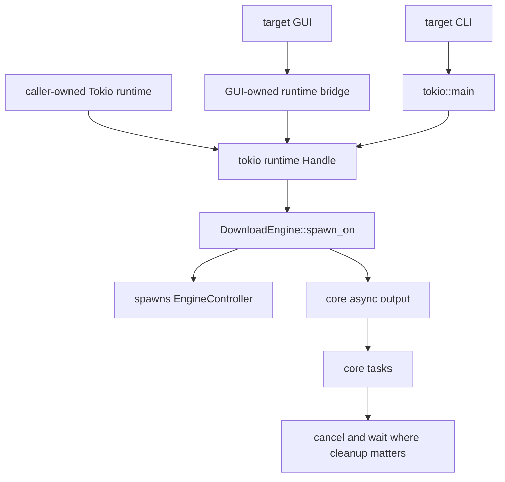
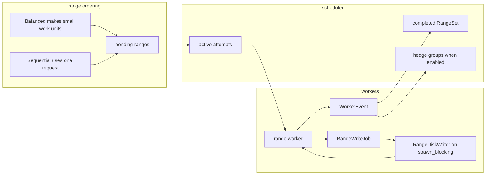
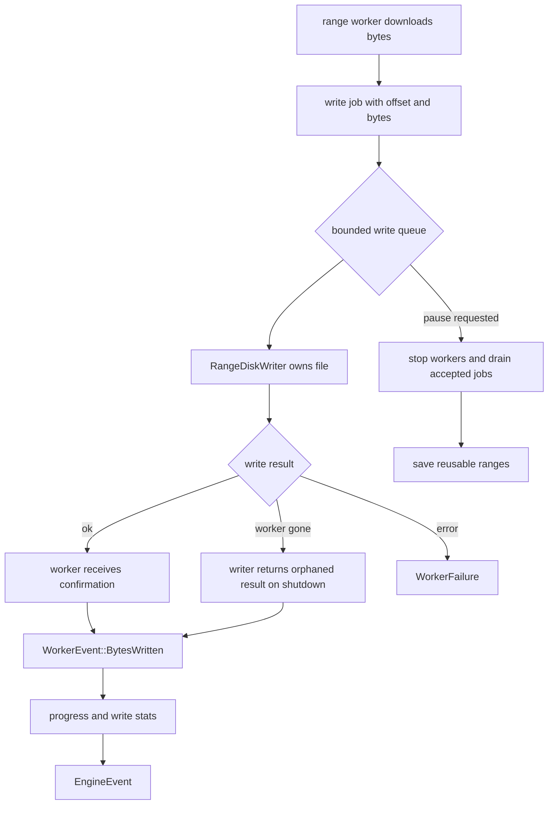
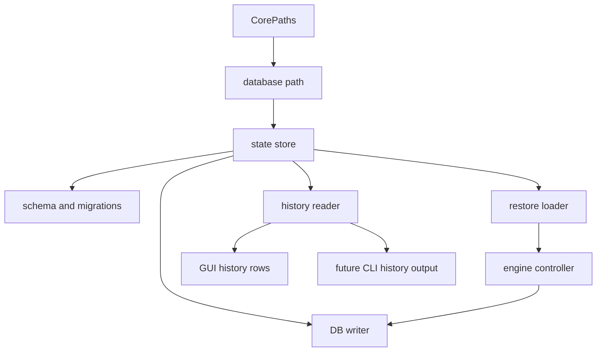
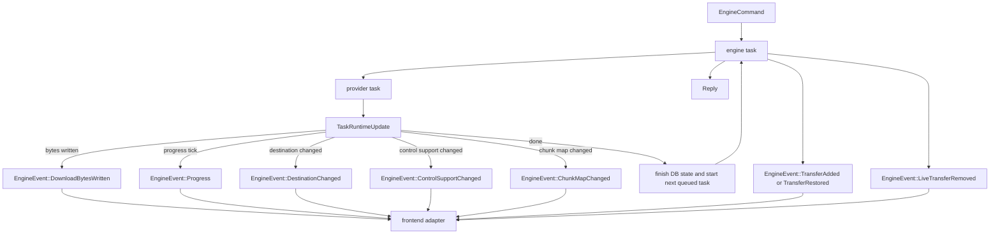

# Ophelia Core Diagrams

These diagrams are a sanity check. If a diagram gets too tangled, the code probably will too.

## Current Package Shape

## Target Crate Shape

## Current Download Path

The current download path label still mentions modal and IPC because that is where the old GUI sends requests from. In this slice, those files are parked outside the workspace while core gets cleaned up.

## Target Core Boundary

## Runtime Ownership

## Range Engine Today

## Range Disk Path

## Persistence Ownership

## Core Event Stream

