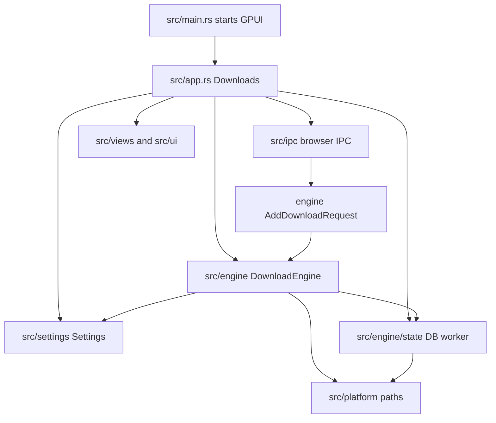
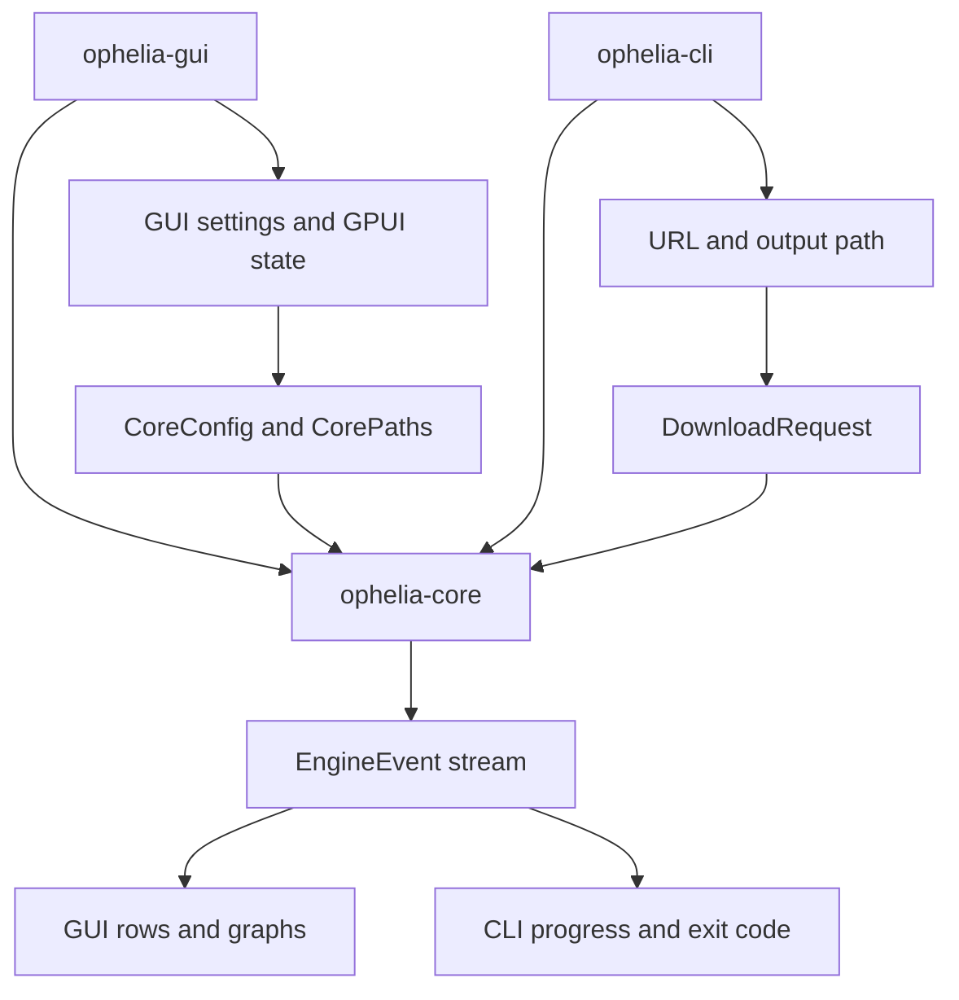
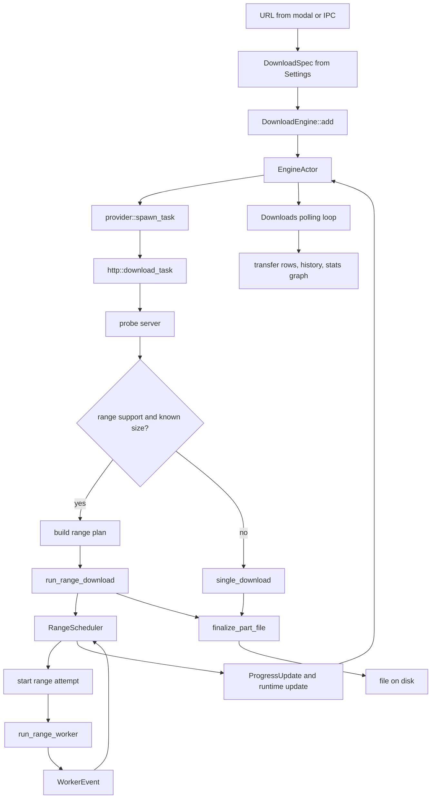
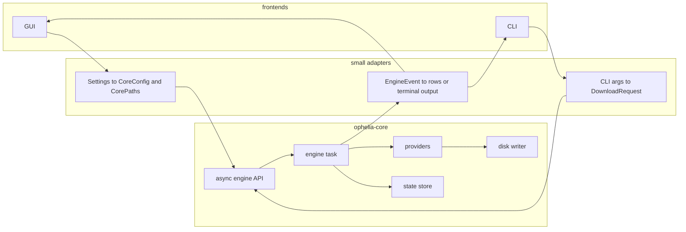
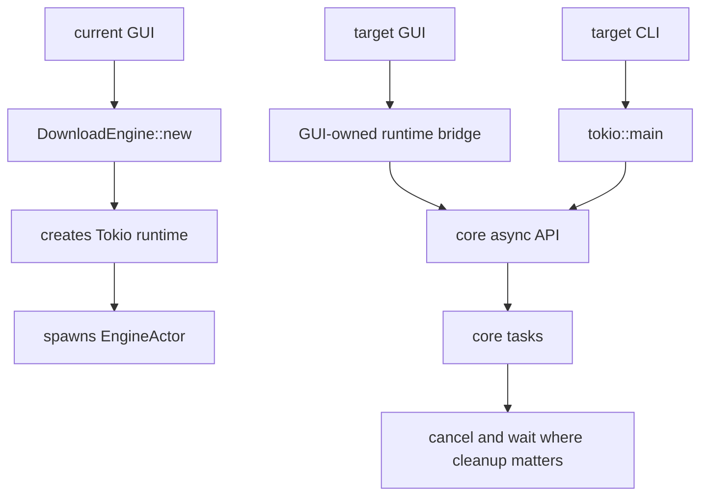
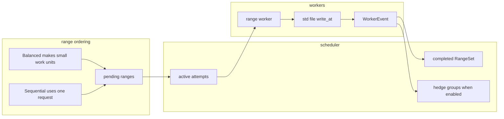
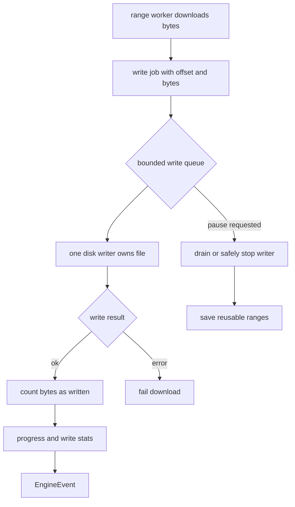
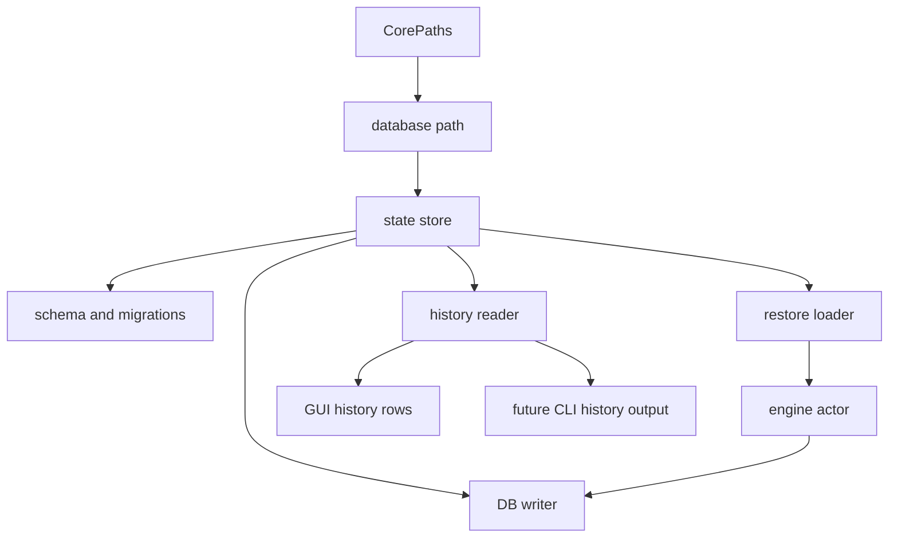
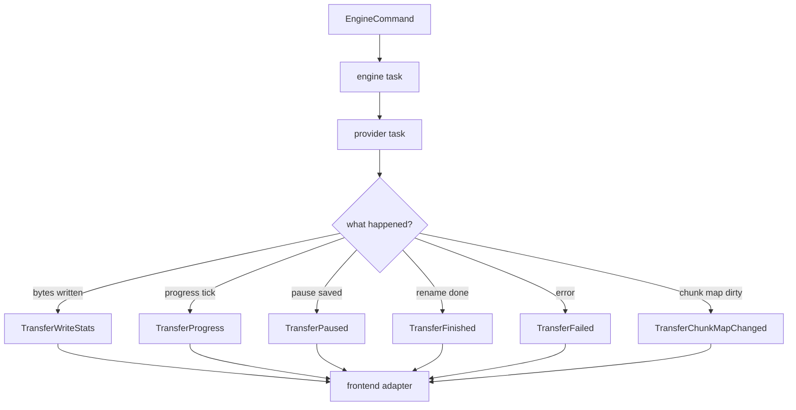

# Ophelia Core Diagrams

These diagrams are a sanity check. If a diagram gets too tangled, the code probably will too.

## Current Package Shape

## Target Crate Shape

## Current Download Path

## Target Core Boundary

## Runtime Ownership

## Range Engine Today

## Target Range Disk Path

## Persistence Ownership

## Core Event Stream

